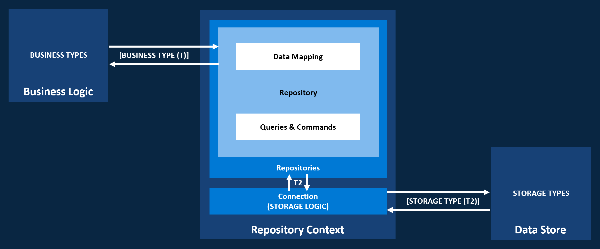

# Repository Pattern

 The [Repository Pattern](https://docs.microsoft.com/en-us/dotnet/architecture/microservices/microservice-ddd-cqrs-patterns/infrastructure-persistence-layer-design#the-repository-pattern) is a well-documented way of working with a data source whereby the underlying storage mechanism is decoupled from the storage intent through an abstraction. This enables the centralization of storage related code and flexibility of the storage mechanism itself making unit testing of business logic easier and driving greater code re-use across solutions. It also enables the use of strongly typed business model objects that are agnostic of the underlying data store. 

## Pattern Overview
There are three high-level components in the standard [Repository Pattern](https://docs.microsoft.com/en-us/dotnet/architecture/microservices/microservice-ddd-cqrs-patterns/infrastructure-persistence-layer-design#the-repository-pattern); The **Business Logic**, **Data Store**, and **Repositories**. The version, illustrated below, has been extended to include the concept of a **Repository Context**.



**Business Logic:**  
The client application business logic executes the queries and commands on a **Repository** (or **Repository Context**) using business models that are agnostic to the underlying data store.

**Data Store:**  
The underlying data store executes (or has executed on it) commands and queries specific to that store and works with the entities or models associated with it. This is handled via an intermediary object or framework component in many cases such as a database connection or context.

**Repository:**  
A **Repository** acts as a bridge between data and operations that are in different domains. Externally, the **Repository** exposes storage operations on strongly typed business model objects. Internally, it uses the underlying storage APIs to implement storage operations using types specific to that data store. The **Repository** facilitates the mapping between these data representations through data mapping. 

**Repository Context:**  
The **Repository Context** encapsulates the initialization and management of the **Connection/Context** object as well as the creation and handling of the individual **Repositories** associated with it. This enables several **Repositories** to share the same **Connection/Context** and optionally support operations on one or more **Repositories** as a single **Unit of Work** where appropriate. The individual **Repositories** are exposed alongside any other higher-level operations.  

## MobCAT Repository Pattern Implementations
The **MobCAT** library provides basic repository pattern implementations for:

* **[Entity Framework Core](https://docs.microsoft.com/en-us/ef/core/)** [[Get Started with EF Core Repositories](repository-efcore-gettingstarted.md)]  


   [](https://dotnetcst.visualstudio.com/MobCAT/_build/latest?definitionId=60&branchName=master)

* **In-Memory Datastore (for prototyping and testing)** [[Get Started with In-Memory Repositories](repository-inmemory-gettingstarted.md)]  


   [](https://dotnetcst.visualstudio.com/MobCAT/_build/latest?definitionId=60&branchName=master)

* **[Sqlite-net](https://github.com/praeclarum/sqlite-net)** [[Get Started with sqlite-net Repositories](repository-sqlite-net-gettingstarted.md)]   


   [](https://dotnetcst.visualstudio.com/MobCAT/_build/latest?definitionId=60&branchName=master)

## MobCAT Components
The **MobCAT** library provides a basic foundation for this pattern through a common abstraction and a set of base classes with implementations for popular frameworks such as [sqlite-net-pcl](https://github.com/praeclarum/sqlite-net) and [Entity Framework Core](https://docs.microsoft.com/en-us/ef/core/) along with an in-memory implementation to aid in testing and prototyping.  

Each implementation is built using the following base classes:  

- [BaseModel](#basemodel)
- [BaseRepository](#baserepository)
- [BaseRepositoryContext](#baserepositorycontext)

### [BaseModel](../MobCAT/Repositories/BaseModel.cs)
Optional base class for business model objects. Defines a single *Id* **Property**.

### [BaseRepository](../MobCAT/Repositories/BaseRepository.cs)
Base class for storage specific **Repository** base classes implementing **IBaseRepository&lt;T>** where **T** is the agnostic business type. Encapsulates common functionality such as data mapping, recommended practices such as [retry](https://docs.microsoft.com/en-us/azure/architecture/patterns/retry) policies, and the implementation of common CRUD (Create, Read, Update, Delete) and other operations. Exposes virtual methods for handling those aspects that are specific to a given data store minimizing code duplication.

#### Indicative Usage

Base class for entity/model objects specific to the data store
```cs
public class BaseCustomModel
{
   [PrimaryKey]
   public string Id { get; set; }
}
```

Base class for repositories specific to the data store
```cs
public class BaseCustomRepository<T, T2> : BaseRepository<T, T2, CustomException> where T2 : BaseCustomModel
{
   protected override Task OnInitializeAsync() {...}
   protected override Task OnDropTableAsync() {...}
   protected override Task<IEnumerable<T2>> OnExecuteTableQueryAsync(Expression<Func<T2, bool>> expression = null) {...}
   protected override Task<T2> OnExecuteTableQueryScalarAsync(Expression<Func<T2, bool>> expression = null) {...}
   protected override Task<IEnumerable<T2>> OnGetAsync() {...}
   protected override Task<T2> OnGetItemAsync(string id) {...}
   protected override Task OnInsertAsync(IEnumerable<T2> items) {...}
   protected override Task OnInsertItemAsync(T2 item) {...}
   protected override Task OnUpdateAsync(IEnumerable<T2> items) {...}
   protected override Task OnUpdateItemAsync(T2 item) {...}
   protected override Task OnUpsertAsync(IEnumerable<T2> items) {...}
   protected override Task OnUpsertItemAsync(T2 item) {...}
   protected override Task OnRemoveAsync(IEnumerable<T2> items) {...}
   protected override Task OnRemoveAllAsync() {...}
   protected override Task OnRemoveItemAsync(T2 item) {...}
}
```

### [BaseRepositoryContext](../MobCAT/Repositories/BaseRepositoryContext.cs)
Base class for storage specific **RepositoryContext** base classes implementing **IBaseRepositoryContext&lt;T>** where **T** is the **Connection/Context** intermediary object or framework component that is used to connect to and/or execute commands and queries against the respective data store. Encapsulates the initialization and management of the **Connection/Context** object as well as the creation and handling of the individual **Repositories** associated with it. Exposes virtual methods for handling those aspects that are specific to a given data store minimizing code duplication.

#### Indicative Usage

Base class for a repository store specific to a data store
```cs
public class BaseCustomRepositoryContext : BaseRepositoryContext<CustomConnection>
{
   public BaseCustomRepositoryContext(string folderPath, string datastoreName)
      : base(folderPath, datastoreName) {}

   protected override async Task OnCloseConnectionAsync()
      => Connection.CloseAsync();

   protected override async Task<CustomConnection> OnOpenConnectionAsync(string datastoreFilepath)
   {
      var connection = new CustomConnection(datastoreFilepath);
      
      // Setup connection using optimum configuration e.g.
      await connection.SetDataStoreSettingAsync(value).ConfigureAwait(false);

      return connection;
   }
}
```

**NOTE:** For data stores that do not require the use of a local file, it is possible to implement the **IRepositoryContext** interface directly. See **[BaseInMemoryRepositoryContext](../MobCAT/Repositories/BaseInMemoryRepositoryContext.cs)** as an example.